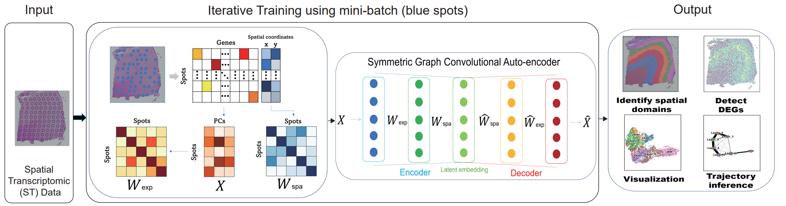

# SGCAST

## Overview
SGCAST is a simple and efficient auto-encoder framework to identify spatial domains. SGCAST adopts a Symmetric Graph Convolutional Auto-encoder to learn aggregated latent embeddings via integrating the gene expression similarity and the proximity of the spatial spots. SGCAST employs a mini-batch training strategy, which makes SGCAST memory efficient and scalable to high-resolution spatial transcriptomic data with a large number of spots. The latent embeddings given by SGCAST can be used for clustering, data visualization, trajectory inference, and other downstream analyses.



## Tutorials

+ Data preprocessing tutorial is demonstrated here: [link](https://github.com/cuhklinlab/SGCAST/blob/main/data_preprocess.ipynb)
+ Tutorial for clustering: 
    + DLPFC dataset [link](https://github.com/cuhklinlab/SGCAST/blob/main/DLPFC_clustering.ipynb)
    + high-resolution data [link](https://github.com/cuhklinlab/SGCAST/blob/main/high-res_clustering.ipynb)


SGCAST is implemented in the pytorch framework. Please run SGCAST on CUDA. SGCAST can be obtained by clonning the github repository:

### Installation
#### Start by grabbing source codes:
```bash
git clone https://github.com/cuhklinlab/SGCAST-main.git
cd SGCAST-main
```

(Recommended) Using python virtual environment with [`conda`](https://anaconda.org/)

```bash
conda env create -f environment.yaml # To reproduce the result, use the environment and train on Tesla V100 GPU
conda activate sgcast_env
```

### Install package mclust 5.4.10 in R (used for the mclust clustering)


## Running SGCAST on DLPFC from 10x Visium.
``` cd /home/.../SGCAST-main/SGCAST-main```
```python
import torch
import os
import random
from datetime import datetime
import numpy as np
from train import Training 
import copy
import scanpy as sc
import matplotlib.pyplot as plt
import pandas as pd

######
###### load and prepare input
# load h5 file 
input_dir = "../data/DLPFC/"
section_id = '151673'
adata = sc.read_visium(path=input_dir+section_id, count_file=section_id+'_filtered_feature_bc_matrix.h5')
adata.var_names_make_unique()


# step 1: select 3000 highly variable genes
sc.pp.highly_variable_genes(adata, flavor="seurat_v3", n_top_genes=3000)
# step 2: normalize each cell by total counts over all genes, so that every cell has the same total count after normalization
sc.pp.normalize_total(adata, target_sum=1e4)
# step 3: logarithmize the count matrix
sc.pp.log1p(adata)
# The true labels are extracted from data from R package 'spatialLIBD' and stored as “section_id_truth.txt”
Ann_df = pd.read_csv(input_dir+section_id+"/"+section_id+"_truth.txt", sep='\t', header=None, index_col=0)

Ann_df.columns = ['Ground Truth']
# add 'Ground Truth' to adata
adata.obs['Ground Truth'] = Ann_df.loc[adata.obs_names, 'Ground Truth']
# draw the ground truth plot of the sample
plt.rcParams["figure.figsize"] = (3, 3)
sc.pl.spatial(adata, img_key="hires", color=["Ground Truth"])
# save the processed adata to the path waiting for training
adata.write(input_dir+section_id+'/'+section_id+'.h5ad')

#####
##### Prepare config and run training
class Config(object): # we create a config class to include all paths and parameters 
    def __init__(self):
        self.use_cuda = True
        self.threads = 1
        self.device = torch.device('cuda:0')
        self.spot_paths = ["../data/DLPFC/"+section_id+"/"+section_id+".h5ad"] 
        # in spot_paths, there can be multiple paths and SGCAST will run on the data one by one
        # Training config
        self.nfeat = 50 
        self.nhid = 50
        self.nemb = 50
        self.batch_size = 2000  
        self.lr_start = 0.2 
        self.lr_times = 2
        self.lr_decay_epoch = 80 
        self.epochs_stage =100 
        self.seed = 2022
        self.checkpoint = ''
        self.train_conexp_ratio = 0.07 
        self.train_conspa_ratio = 0.07
        self.test_conexp_ratio = 0.07 
        self.test_conspa_ratio = 0.07 


config = Config()


config_used = copy.copy(config)
config_used.spot_paths = config.spot_paths[0]
# set random seed for each package
torch.manual_seed(config_used.seed)
random.seed(config_used.seed)
np.random.seed(config_used.seed)
# record starting time
a = datetime.now()
print('Start time: ', a.strftime('%H:%M:%S'))
# reset GPU memory
torch.cuda.reset_peak_memory_stats()
# start training
print('Training start ')
model_train = Training(config_used)
# for each epoch, there will be a reminder in a new line
for epoch in range(config_used.epochs_stage):
    print('Epoch:', epoch)
    model_train.train(epoch)

# finish training
b = datetime.now()
print('End time: ', b.strftime('%H:%M:%S'))
c = b - a
minutes = divmod(c.seconds, 60)
# calculate time used in training
print('Time used: ', minutes[0], 'minutes', minutes[1], 'seconds')

print('Write embeddings')
model_train.write_embeddings()
# write result to output path
print('Training finished: ', datetime.now().strftime('%H:%M:%S'))
print("torch.cuda.max_memory_allocated: %fGB" % (torch.cuda.max_memory_allocated(0) / 1024 / 1024 / 1024))
    # tell how much GPU memory used during training
#### save path is "./output" by default, which you can change in train.py

#####
##### Clustering using latent embeddings and calculate ARI
import sys
from utils.utils import refine
import matplotlib.pyplot as plt
from sklearn.metrics.cluster import adjusted_rand_score

ARIset=[]
# sample ID 
ID = section_id
# output path where the result embeddings store
base_path = './output'

# input .h5ad file
file_name = "../data/DLPFC/"+section_id+"/"+section_id+".h5ad"
adata = sc.read_h5ad(file_name)

# result embeddings for the sample
spots_embeddings = np.loadtxt(os.path.join(base_path, ID+'_embeddings.txt'))
adata.obsm['embedding'] = np.float32(spots_embeddings)
# set random seed for following clustering
random_seed = 2022
np.random.seed(random_seed)
# set R path in 'R_HOME' and rpy2 path in 'R_USER'
#### ATTENTION
os.environ['R_HOME'] = "R_path_with_package_mclust" ### YOUR OWN PATH where 'R' is and YOU NEED TO INSTALL MCLUST IN 'R'
os.environ['R_USER'] = 'python_path/python3.9/site-packages/rpy2' ### YOUR OWN PATH where 'ryp2' is
# import required packges to use mclust in R and load results from R
import rpy2.robjects as robjects

robjects.r.library("mclust")

import rpy2.robjects.numpy2ri

rpy2.robjects.numpy2ri.activate()
# set random seed for following clustering
r_random_seed = robjects.r['set.seed']
r_random_seed(random_seed)
rmclust = robjects.r['Mclust']
# set mclust parameters
num_cluster = 7; modelNames="EEE" 
# run mclust
res = rmclust(rpy2.robjects.numpy2ri.numpy2rpy(adata.obsm['embedding']), num_cluster, modelNames) 
# get labels from mclust results
mclust_res = np.array(res[-2])
# add predicted labels in adata and convert type to category
adata.obs['mclust'] = mclust_res
adata.obs['mclust'] = adata.obs['mclust'].astype('int')
adata.obs['mclust'] = adata.obs['mclust'].astype('category')

# drop na observation
obs_df = adata.obs.dropna()
# calculate ARI 
ARI = adjusted_rand_score(obs_df['mclust'], obs_df["Ground Truth"])

#############refine
from scipy.spatial.distance import cdist
# get coordinates for spots
xarr=np.array([adata.obs['array_row'].tolist()]).T
yarr=np.array([adata.obs['array_col'].tolist()]).T
am = np.concatenate((xarr,yarr), 1)
# calculate pairwise distance between spots, prepare for the next step
arr = cdist(am, am)
# refine predicted labels according to majority vote of neighbors
refined_pred=refine(sample_id=adata.obs.index.tolist(), pred=adata.obs["mclust"].tolist(), dis=arr, shape="hexagon")
adata.obs["refined_pred"]=refined_pred
adata.obs["refined_pred"]=adata.obs["refined_pred"].astype('category')
# calculate ARI using refined labels
obs_df = adata.obs.dropna()
ARI_ref = adjusted_rand_score(obs_df['refined_pred'], obs_df["Ground Truth"])
ARI_ref

plt.rcParams["figure.figsize"] = (3, 3)
   
sc.pl.spatial(adata, color=["refined_pred", "Ground Truth"], title=['SGCAST(ARI=%.2f)' % ARI_ref,
                                                                        "Manual annotation"]) 
save_path = './output'
plt.savefig(os.path.join(save_path, f'{ID}_results.pdf'), bbox_inches='tight', dpi=300)
```
## Three steps when quick running in terminal
### Step 1 : Edit `Config.py` according to the data input (See Arguments section for more details).
### Step 2 : 

In terminal, run
```
python main.py
```
The embedding output will be saved in `./output` folder.

### Step 3 : Edit `DLPFC_ARI_check.py` for your file path, R path and ryp2 path
### Edit `high-res_downstream.py` for your file path, and louvain clustering parameters
In terminal, run
```
python DLPFC_ARI_check.py
```
or for high resolution data, run
```
python high-res_downstream.py
``` 
The plot output plot will be saved in `./output` folder.


## Arguments

The script `Config.py` indicate the arguments for SGCAST, which needs to be modified according to the data.


### Training config

+ `threads`: Number of threads used (set as 1 by default)
+ `spot_paths`: paths of input data (can be multiple paths, which will be trained under the same configuration.)
+ `batch_size`: Batch size (set as 2000 by default)
+ `lr_start`: Initial learning rate (set as 0.2 by default)
+ `lr_decay_epoch`: Number of epochs learning rate decay
+ `nfeat`: Dimension of input of auto-encoder
+ `nhid`: Dimension of hidden layer of auto-encoder
+ `nemb`: Dimension of latent embedding of auto-encoder
+ `seed`: seed to be used
+ `train_conexp_ratio`: tau for expression layer in training 
+ `train_conspa_ratio`: tau for spatial layer in training 
+ `train_conexp_ratio`: tau for expression layer when writing results
+ `train_conexp_ratio`: tau for spatial layer when writing results


The configuration we used in our paper can be found in [link](https://github.com/cuhklinlab/SGCAST/blob/main/SGCAST-main/Config.py).

### Download data
|      Platform      |       Tissue     |    SampleID   |
|:----------------:|:----------------:|:------------:|
| [10x Visium](https://support.10xgenomics.com) | Human dorsolateral pre-frontal cortex (DLPFC) | [DLPFC dataset](http://spatial.libd.org/spatialLIBD) |
| [Stereo-seq](https://www.biorxiv.org/content/10.1101/2021.01.17.427004v2) | Mouse olfactory bulb| [Mouse olfactory bulb](https://github.com/JinmiaoChenLab/SEDR_analyses/) |
| [Sec-scope](https://doi.org/10.1101/2021.01.25.427807) | Mouse Colon| [Mouse Colon](https://deepblue.lib.umich.edu/data/concern/data_sets/9c67wn05f) |
| [Stereo-seq](https://www.biorxiv.org/content/10.1101/2021.01.17.427004v2) | Mouse Embryo| [Mouse Embryo](https://db.cngb.org/stomics/mosta/download/) |


## Reference
